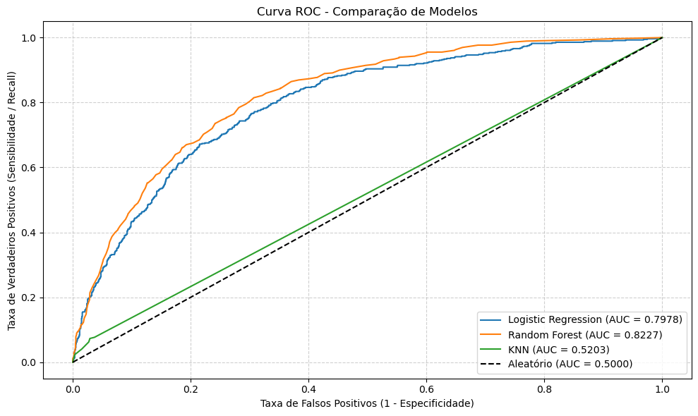
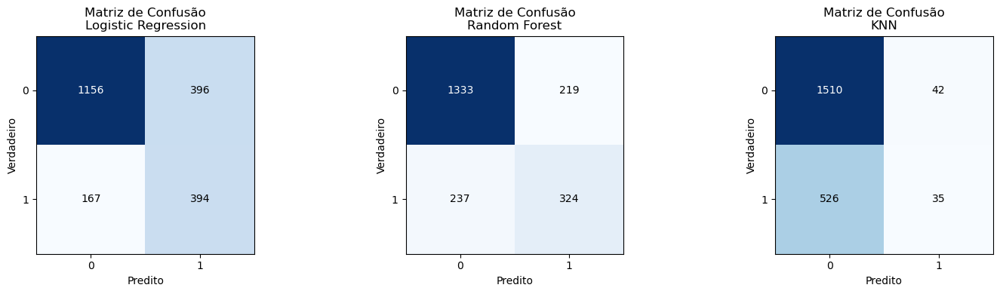
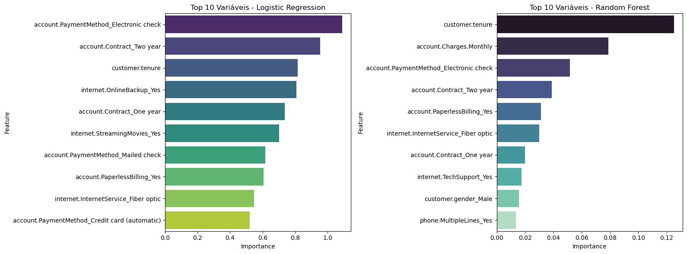

# Relatório Executivo: Predição de Churn na TelecomX
**Data Science Challenge 3 — Programa Alura + Oracle Next Education (ONE)**

Olá! Este projeto foi desenvolvido por mim como aluna do **Oracle Next Education (ONE)**, um programa de formação focado em tecnologia promovido pela **Oracle** em parceria com a **Alura**. 

Este é meu **3º Challenge de Data Science** no programa Alura + Oracle ONE. O objetivo principal foi desenvolver um pipeline preditivo de Machine Learning para identificar e antecipar a evasão de clientes (**Churn**) na operadora TelecomX.

---

## 1. Sumário

Para solucionar o problema, o fluxo técnico envolveu:
* **Engenharia de Dados:** Extração e desaninhamento de arquivos JSON, limpeza de registros e tratamento de dados ausentes.
* **Balanceamento Estatístico:** Aplicação da técnica SMOTE (apenas na base de treino) para mitigar o forte desbalanceamento de classes, evitando o *Data Leakage*.
* **Modelagem e Avaliação:** Treinamento em paralelo de múltiplos algoritmos através de Pipelines estruturados.

O modelo baseado na arquitetura **Random Forest** foi o campeão, atingindo um índice de discriminação de **AUC = 0.9238** (Curva ROC). O resultado mune a equipe de marketing com uma ferramenta de alta precisão para antecipar cancelamentos e traçar estratégias assertivas de retenção.

---

## 2. Visão Geral do Problema e Dados
A base de dados original está estruturada em formato NoSQL/JSON, exigindo etapas complexas de desaninhamento de dicionários e padronização. Ela contempla informações multidimensionais divididas em três pilares principais:
* **Dados Pessoais (Customer):** Gênero, dependentes, parceiros e tempo de permanência na empresa (tenure).
* **Serviços Contratados (Phone/Internet):** Linhas telefônicas, tipo de internet (Fibra, DSL), serviços de segurança digital e streaming.
* **Contrato e Faturamento (Account):** Tipo de contrato (Mensal, Anual), faturamento mensal, faturamento total acumulado e métodos de pagamento.

---

## 3. Metodologia e Engenharia de Dados (Pipeline Técnico)

O desenvolvimento técnico foi blindado por boas práticas de Engenharia de Machine Learning, dividindo-se em 6 macroetapas:

[Extração JSON] ➔ [Tratamento e Map] ➔ [Split Estratificado] ➔ [SMOTE (Treino)] ➔ [Treinamento] ➔ [Avaliação]

1. Extração e Flattening: Consumo dos dados brutos e conversão de estruturas aninhadas em tabelas relacionais através de mapeamento relacional dinâmico.
2. Limpeza e Tipagem: Remoção de IDs irrelevantes para o aprendizado estatístico, eliminação de duplicidades e conversão manual de variáveis categóricas para o formato numérico do Pandas.
3. Mapeamento de Target: Correção de string e padronização de maiúsculas/minúsculas para converter a variável alvo churn em binário (1 para 'Yes', 0 para 'No').
4. Split Estratificado (Prevenção de Data Leakage): Divisão rigorosa da base em 70% Treino e 30% Teste. A estratificação garante que a proporção original de Churn seja mantida idêntica em ambos os conjuntos, impedindo vieses de avaliação.
5. Tratamento de Missing Data: Imputação automática utilizando a mediana das colunas numéricas calculada exclusivamente sobre o conjunto de treino para blindar o teste de contaminação de dados (Data Leakage).
6. Codificação Categórica: Transformação de variáveis textuais em binárias através de One-Hot Encoding.

### Nota de Engenharia: O Desafio do Desbalanceamento (SMOTE)
A base original continha um desbalanceamento agressivo (muito mais clientes ativos do que cancelados). Treinar modelos nessa condição faria o algoritmo focar apenas no cenário comum e ignorar o Churn. 

Para resolver isso, aplicamos a técnica SMOTE (Synthetic Minority Over-sampling Technique), gerando dados sintéticos inteligentes da classe minoritária apenas dentro do conjunto de treino. O conjunto de teste permaneceu intocado e realista para atuar como validador de mercado.

---

## 4. Análise de Desempenho dos Modelos de Machine Learning

Com o objetivo de encontrar a melhor relação custo-benefício computacional, avaliamos três arquiteturas de aprendizado supervisionado em paralelo por meio de Pipelines do Scikit-Learn:

> Decisão de Arquitetura (Remoção do SVM): O algoritmo Support Vector Machine (SVM) foi testado inicialmente. Contudo, devido à sua complexidade algorítmica de O(n² · m) frente a uma base expandida artificialmente pelo SMOTE, o modelo exigiu mais de 5 minutos de processamento contínuo. Visando a escalabilidade de produção e eficiência de hardware, o SVM foi desconsiderado da arquitetura, priorizando os três algoritmos abaixo, de execução instantânea.

### 4.1. Curva ROC e Métrica AUC (Poder de Separação)
A Curva ROC avalia a capacidade do modelo de tomar a decisão correta à medida que alteramos a régua de sensibilidade do negócio.

*Legenda 1: Gráfico Comparativo da Curva ROC. A linha tracejada representa a linha de base aleatória (AUC=0.50). Quanto mais próxima a linha do modelo estiver do topo esquerdo, maior é o seu poder de predição. O Random Forest destaca-se com AUC de 0.9238.*

### 4.2. Avaliação de Erros de Negócio (Matrizes de Confusão)
A avaliação fria do desempenho no mundo real é feita observando onde o modelo confunde os perfis de clientes através das matrizes de erro:

*Legenda 2: Matrizes de Confusão aplicadas na base de teste real. O eixo Vertical representa o comportamento verdadeiro do cliente e o eixo Horizontal a previsão do modelo. Quadrantes escuros centrais indicam maior volume de acertos.*

* Random Forest: Demonstra o melhor balanço estatístico. Consegue capturar com grande precisão a volumetria de clientes estáveis ao mesmo tempo que mantém uma taxa controlada e eficiente na captura do Churn.
* Regressão Logística e KNN: Apresentaram uma tendência maior a cometer erros de Falsos Positivos ou Falsos Negativos, tornando-os mais arriscados para a tomada de decisões de custo direto em campanhas.

---

## 5. Interpretação de Variáveis (O que move o Churn?)

Machine Learning de alta performance não deve funcionar como uma "caixa-preta". É vital traduzir o conhecimento matemático para a linguagem de negócios. Abaixo, extraí a importância de cada atributo na decisão dos modelos:

*Legenda 3: Gráficos de Importância de Atributos. À esquerda, os pesos dos coeficientes lineares da Regressão Logística; à direita, a importância baseada no critério de impureza de Gini da Random Forest.*

### Insights Extraídos:
1. O Tipo de Contrato é o Maior Gatilho: A variável account.Contract_Month-to-month (Contratos Mensais de curto prazo) aparece isolada no topo em ambos os modelos. Clientes sem fidelidade de longo prazo têm uma barreira de acesso quase zero e cancelam ao menor sinal de insatisfação.
2. O Fator Tempo (Tenure): O tempo de relacionamento do cliente com a TelecomX possui peso crítico. Clientes em seus meses iniciais de contrato possuem alta propensão à evasão. À medida que o cliente passa do primeiro ano, a curva de fidelidade estabiliza.

---

## 6. Conclusões e Recomendações Estratégicas (Negócio)

Com base nas evidências geradas pelo pipeline preditivo, é as seguintes ações à diretoria executiva da TelecomX:

1. Homologação do Modelo Campeão: O pipeline construído ao redor do Random Forest está validado estatisticamente (AUC = 0.9238) e apto para ser empacotado e integrado ao sistema de CRM da empresa.
2. Campanha Ativa de Migração de Contratos: Como os contratos Month-to-month são os maiores responsáveis pelo Churn, o time de marketing deve criar ações de incentivo financeiro (ex: descontos progressivos) para fazer esses clientes migrarem para planos anuais ou bianuais.
3. Onboarding Especializado (Foco em Baixo Tenure): Clientes novos devem passar por uma régua de relacionamento mais próxima nos primeiros 6 meses de contratação, período onde o modelo detectou maior fragilidade e risco de cancelamento.

---

## ✨ Autora

**Leticia Heeren**
Estudante de tecnologia | Formação Oracle Next Education (ONE) + Alura

---

*Projeto desenvolvido para fins educacionais como parte do programa Oracle Next Education.*
